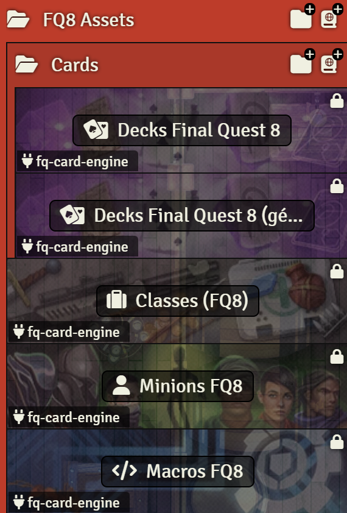
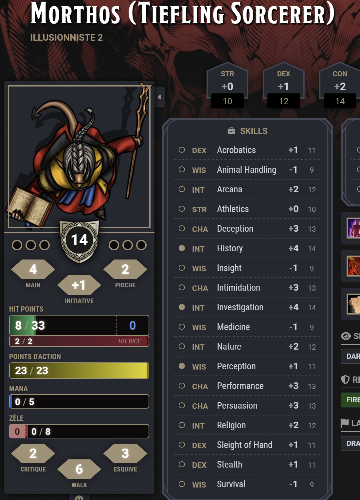
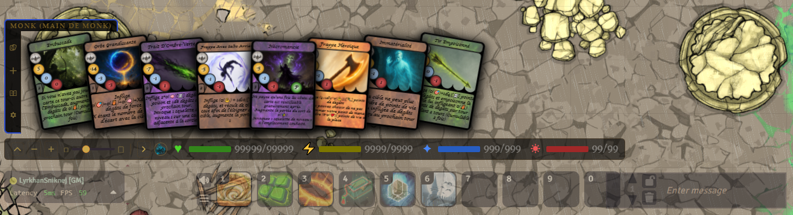
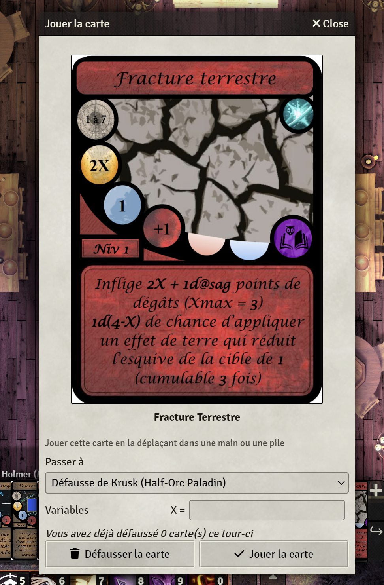
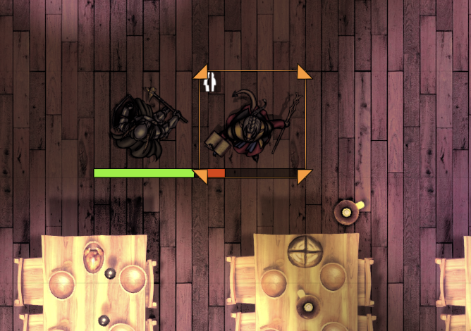
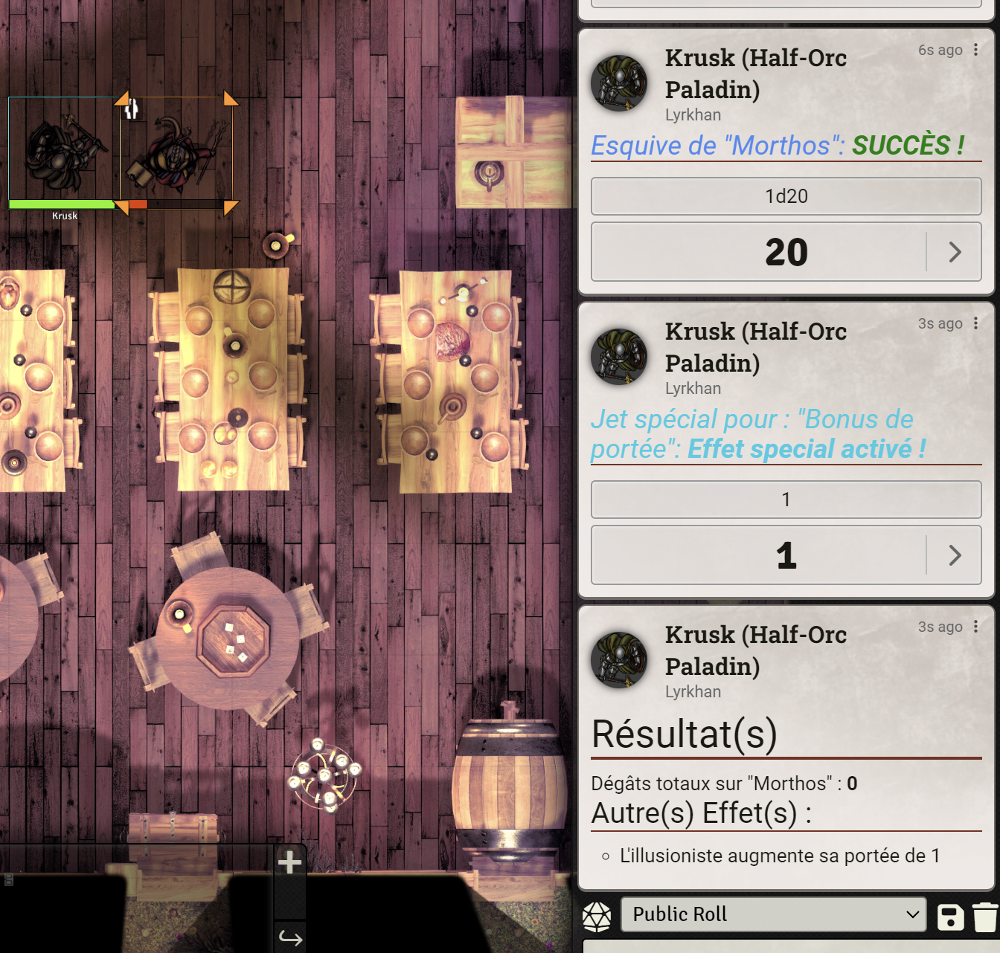

# FQ Card Engine for FoundryVTT

FQ Card Engine - A system of combat for Final Quest 8 x DnD5e

Based on the work of Lyrkhan : FQ Card Engine (https://github.com/LyrkhanJenkins/fq-card-engine)

## Modules obligatoires
- socketlib https://foundryvtt.com/packages/socketlib
- lib-wrapper https://foundryvtt.com/packages/lib-wrapper

## Autres Modules conseillés
- DAE https://foundryvtt.com/packages/dae (non à jour)
- Dice So Nice https://foundryvtt.com/packages/dice-so-nice
- Not your turn https://foundryvtt.com/packages/NotYourTurn
- Card Viewer https://foundryvtt.com/packages/orcnog-card-viewer

## Final Quest 8

Final Quest 8 is a Board game with trading card for a dynamic combat system.
The 8th Version is an adaptation to combine the trading card battle system with DND5e System

## How To Play ?

### Compendium
The module provides several resources for start playing Final Quest 8 :
- Cards for the first 5 level
- Classes
- Items
- Passive Spells
- Monsters
- Macros

### Choose Class
(How to generate a deck for each level)

### Character new resources
Specials resources are used for using cards or spells for FQ battle system.

FQ resource values are found in a custom character sheet for characters and NPCs.

### Using Card

In combat, cards are picked each turn with your hand and pick score.

Card are clickable, a dialog opens, displaying the card and its description. 
You can choose to play the card or discard it to use other cards.

For using cards that affects other target than ypu, you must target at least one character

All actions are displayed on chat.
After playing a card, automatic roll, effect, damage, heal are applied, also critical and evasion rolls.

## Version
### 0.1.2 - alpha (En Cours):

### 0.1.1 - alpha:
    #### Feature:
    - Automatic damage/heals with critical hits and dodges (option to disable and prevent conflicts?)
    - Manage range for spells
    - Creation of compendiums and migration of passive spells for NPCs
    - Dodging sound should not use the classic damage sound
    - Management of custom damage bonuses (corrections needed for familiars, cards, damage)
    #### Fix:
    - Custom evaluation of diagonal attack (Illusionist cards)
    - Effect of enchanted whip (Illusionist cards)
    - Bug with drawing a hand when a user has no character or is missing one?
    - Bug if no deck: Return a clean error
    - Bug if Card Viewer module is not present
    - Issue with the style of replayable cards

### 0.1.0 - alpha:
    #### Feature:
    - Ability to modify the consumption of items
    - All items (spells, objects) can consume FQ resources
    - CI/CD pipeline for updating module automatically

### 0.0.2 - alpha:
    #### Feature:
    - Integration of CardViewer
    - Migration of macros
    - X and Y field required on play dialog
    - Limite players cards right
    - Launch initiative automatically
    #### Fix:
    - Passive effects not flipping cards
    - apply DOT each turn
    - Remove effect after using
    - Minions combat's turn just after the master
    - Option of hand size for player (local storage)
    - Max value can't be exceeded

### 0.0.1 - alpha:
    - Card System for Foundry v12
