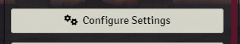
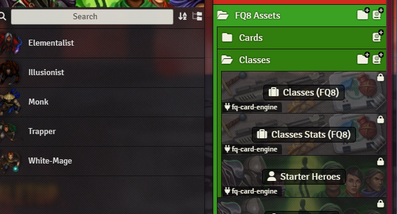
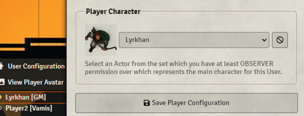
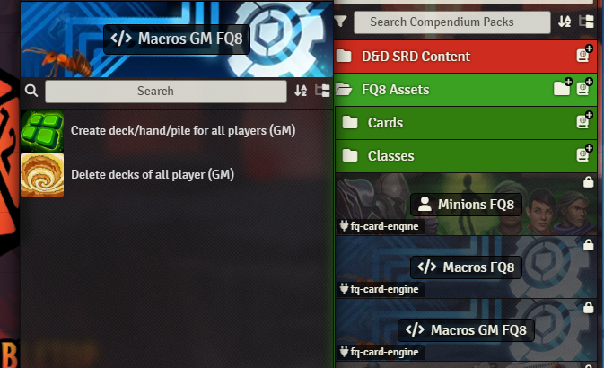
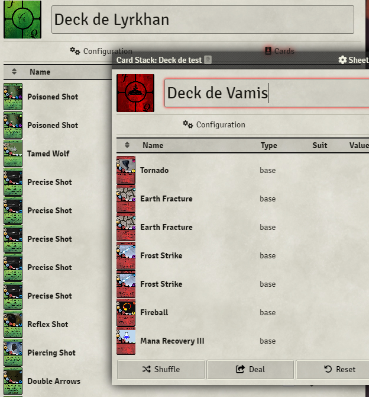
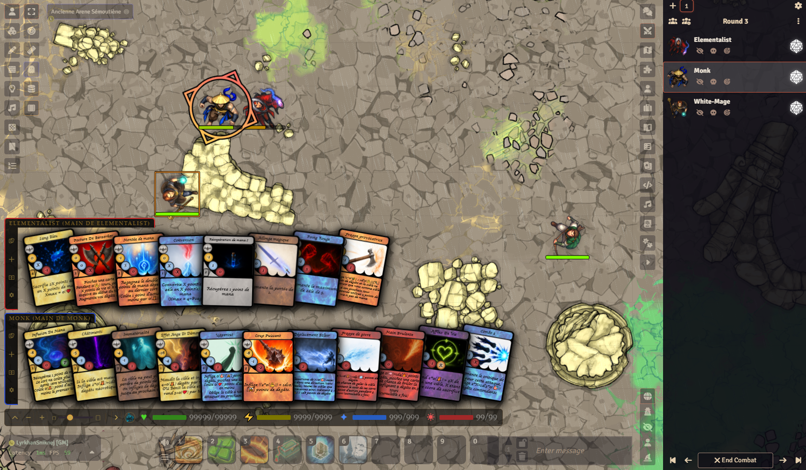
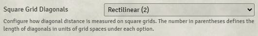

# FQ Card Engine for FoundryVTT

The FQ Card Engine is a combat system for Final Quest 8 combined with DnD5e rules.

## Mandatory modules
- socketlib https://foundryvtt.com/packages/socketlib
- lib-wrapper https://foundryvtt.com/packages/lib-wrapper

## Optional modules
- DAE https://foundryvtt.com/packages/dae (non à jour)
- Dice So Nice https://foundryvtt.com/packages/dice-so-nice
- Card Viewer https://foundryvtt.com/packages/orcnog-card-viewer

## Get Started

- Start by selecting your preferred language in "Configure Settings". This will determine the language of the cards generated later.

- Next, create your players in "User Management".*

- To create characters for your players, you have two options:
    - 1) Use the **Starter heroes** in FQ Compendium
    - 2) Drag and drop **Classes** to your own personal character

- Don't forget to associate each character with a player.
  

- As a GM, you can create decks, hands and piles for all of your players.

- This will generate and open all decks for your players.

(Note: Decks are generated up to level 5. After that, decks are customizable and cannot be destroyed by the macros.)

[img_5.png](images/doc/assign-hand-toolbar.png)

- Everything is now set up to play. Start combat with your characters, and cards will automatically be drawn, with picks and hand scores applied. _(See more details in the rulebook.)_
  **_(Make sure your players are connected!)_**

## Final Quest 8

### Compendium
Final Quest 8 is a Board game with trading card for a dynamic combat system.
The 8th Version is an adaptation to combine the trading card battle system with DND5e System

The module provides several resources for start playing Final Quest 8 :
- Cards for the first 5 level
- Classes
- Items
- Passive Spells
- Monsters
- Macros

### Character new resources
Specials resources are used for using cards or spells for FQ battle system.

FQ resource values are found in a custom character sheet for characters and NPCs.

### Using Card

In combat, cards are picked each turn with your hand and pick score.

Card are clickable, a dialog opens, displaying the card and its description.
You can choose to play the card or discard it to use other cards.

For using cards that affects other target than ypu, you must target at least one character

All actions are displayed on chat.
After playing a card, automatic roll, effect, damage, heal are applied, also critical and evasion rolls.

## Quick Rule Books:
### New resources for actors:
  - Action Points (yellow): Reset to maximum at the start of each turn. It represents a character's ability to use spells during their turn.
  - Mana (blue): A limited resource used to cast spells.
  - Zeal (red): A resource that increases when using weaker spells and is spent to cast more powerful spells.
  - Hand: The number of cards drawn at the beginning of combat.
  - Pick: The number of cards drawn each turn.
  - Critical: The chance, on a 1d20 roll, to double the damage dealt.
  - Evasion: The chance, on a 1d20 roll, to negate damage.
    - Critical and Evasion can cancel each other out.

### Other
- Level 1 to 5, decks are the same for each character of the same class, after that, decks are customizable
- The cards are design to be used with rectilinear grids

